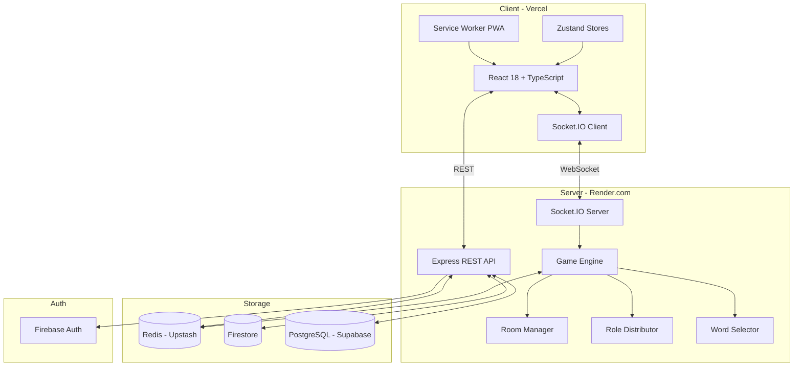

# Design Document: Undercover Game

## Overview

Undercover is a server-authoritative, real-time social deduction web app. Players are secretly assigned roles (Civilian, Undercover, Mr. White) and given related-but-distinct words. Each round players give clues, discuss, and vote to eliminate the suspected impostor. The app supports online multiplayer via WebSockets, local pass-and-play, 8 game modes, a 2,000+ word pair library, player progression, achievements, and a premium content system.

The architecture follows a strict server-authoritative model: all game logic executes on the Node.js server. Clients are pure display layers that render state pushed from the server. Role and word data are never broadcast to the room — they are delivered exclusively over each player's private socket channel.

### Key Design Decisions

- **Server-authoritative**: Prevents cheating; clients cannot infer other players' roles from network traffic.
- **Redis as game state store**: Sub-millisecond reads/writes for hot game state; TTL-based room expiry is native.
- **Socket.IO rooms as isolation boundary**: Each game room maps to a Socket.IO room; private events use `socket.to(socketId).emit()`.
- **Monorepo with shared types**: `/shared/types.ts` is the single source of truth for all data shapes used by both client and server.
- **Zustand over Redux**: Minimal boilerplate, fine-grained subscriptions, and easy integration with React 18 concurrent features.

---

## Architecture



### Request Flow

1. Client authenticates via Firebase → receives JWT in httpOnly cookie.
2. Client connects Socket.IO → server verifies JWT → socket joins private channel + room channel.
3. Host creates room via REST → room state written to Redis.
4. Players join via Socket.IO `room:join` event → server broadcasts updated player list.
5. Host starts game → server runs Role Distributor → sends private `game:role_assigned` to each socket.
6. All subsequent game actions flow through Socket.IO; server mutates Redis state and broadcasts diffs.
7. Non-real-time operations (profile, leaderboard, word fetch) use REST API.

---

## Components and Interfaces

### Server Components

| Component | Responsibility |
|---|---|
| `RoomManager` | Create/join/expire rooms, generate room codes, manage player slots |
| `RoleDistributor` | Assign roles per distribution table, send private role events |
| `WordSelector` | Fetch word pairs from Supabase, apply anti-repeat, handle custom pairs |
| `GameEngine` | Orchestrate phase transitions, enforce timers, evaluate win conditions |
| `ClueManager` | Track turn order, accept clue submissions, enforce timers/strikes |
| `VoteManager` | Collect simultaneous votes, hide until reveal, resolve ties |
| `TournamentManager` | Run 5-game bracket, track cumulative points, rotate roles |
| `ProgressionService` | Award XP, update levels, persist to Firestore |
| `AchievementService` | Evaluate achievement criteria, grant once, notify player |
| `EntitlementService` | Verify premium access for modes and word packs |
| `AuthService` | Firebase JWT verification, guest session management |

### Frontend Components (Hierarchy)

```
App
├── Router (React Router v6)
│   ├── SplashScreen
│   ├── OnboardingScreen
│   ├── MainMenuScreen
│   ├── CreateRoomScreen
│   ├── JoinRoomScreen
│   ├── RoomLobbyScreen
│   │   └── PlayerCard (×N)
│   ├── RoleRevealScreen
│   │   └── FlipCard
│   ├── CluePhaseScreen
│   │   ├── ClueLog
│   │   ├── ClueInput
│   │   └── TurnIndicator
│   ├── DiscussionPhaseScreen
│   │   ├── ClueLog
│   │   └── CountdownTimer
│   ├── VotingScreen
│   │   ├── VoteTarget (×N)
│   │   └── VoteRevealOverlay
│   ├── EliminationScreen
│   │   └── ParticleBurst
│   ├── MrWhiteGuessScreen
│   ├── GameOverScreen
│   │   └── ResultCard
│   ├── ProfileScreen
│   ├── SettingsScreen
│   ├── LeaderboardScreen
│   └── HowToPlayScreen
└── GlobalOverlays
    ├── AchievementToast
    ├── HostControlsDrawer
    └── SpectatorReactionBar
```

### Zustand Stores

```typescript
// Store 1: Authentication
interface AuthStore {
  user: AuthUser | null;
  isGuest: boolean;
  login: () => Promise<void>;
  logout: () => Promise<void>;
  setGuest: (nickname: string) => void;
}

// Store 2: Room
interface RoomStore {
  room: Room | null;
  players: Player[];
  isHost: boolean;
  setRoom: (room: Room) => void;
  updatePlayers: (players: Player[]) => void;
}

// Store 3: Game
interface GameStore {
  gameState: GameState | null;
  myRole: Role | null;
  myWord: string | null;
  clueLog: ClueEntry[];
  votes: VoteRecord[];
  phase: GamePhase;
  setGameState: (state: GameState) => void;
  setMyRole: (role: Role, word: string | null) => void;
  applyDelta: (delta: GameStateDelta) => void;
}

// Store 4: UI
interface UIStore {
  isRoleRevealed: boolean;
  peekActive: boolean;
  hostDrawerOpen: boolean;
  setRoleRevealed: (v: boolean) => void;
  togglePeek: () => void;
}
```

---

## Data Models

All types live in `/shared/types.ts` and are imported by both client and server.

```typescript
// ─── Enums ───────────────────────────────────────────────────────────────────

type Role = 'civilian' | 'undercover' | 'mr_white' | 'detective';

type GamePhase =
  | 'lobby'
  | 'role_reveal'
  | 'clue'
  | 'discussion'
  | 'vote'
  | 'elimination'
  | 'mr_white_guess'
  | 'game_over';

type GameMode =
  | 'classic'
  | 'speed_round'
  | 'team_mode'
  | 'secret_alliance'
  | 'double_agent'
  | 'reverse_mode'
  | 'mr_white_army'
  | 'tournament';

type Difficulty = 'easy' | 'medium' | 'hard';

type TieResolution = 're_vote' | 'all_survive' | 'random';

type WinFaction = 'civilian' | 'undercover' | 'mr_white';

// ─── Core Entities ────────────────────────────────────────────────────────────

interface WordPair {
  id: string;
  wordA: string;
  wordB: string;
  category: string;
  difficulty: Difficulty;
  language: string;
  region: string;
  ageGroup: 'all' | 'teen' | 'adult';
}

interface Player {
  id: string;               // socket ID or stable user ID
  userId: string | null;    // null for guests
  nickname: string;
  avatarUrl: string | null;
  role: Role | null;        // null until role assigned; never sent to other clients
  word: string | null;      // null until assigned; never sent to other clients
  isHost: boolean;
  isActive: boolean;        // false when eliminated
  isConnected: boolean;
  joinOrder: number;
  strikes: number;          // Speed Round strikes
}

interface Room {
  code: string;             // 6-char alphanumeric, no 0/O/1/I
  hostId: string;
  players: Player[];
  config: GameConfig;
  phase: GamePhase;
  createdAt: number;        // Unix ms
  lastActivityAt: number;   // Unix ms; TTL reset on any activity
  passwordHash: string | null;
}

interface GameConfig {
  mode: GameMode;
  category: string;
  difficulty: Difficulty;
  clueTimerSeconds: number | null;   // null = unlimited
  discussionTimerSeconds: number | null;
  tieResolution: TieResolution;
  postEliminationReveal: boolean;
  detectiveEnabled: boolean;
  silentRoundEnabled: boolean;
  customWordPair: WordPair | null;
  maxPlayers: number;                // 3–12
}

interface ClueEntry {
  playerId: string;
  nickname: string;
  clue: string | null;    // null = skipped
  round: number;
  timestamp: number;
}

interface VoteRecord {
  voterId: string;
  targetId: string;
  round: number;
}

interface GameState {
  roomCode: string;
  round: number;
  phase: GamePhase;
  activePlayers: string[];          // player IDs still in game
  spectators: string[];             // eliminated player IDs
  clueLog: ClueEntry[];
  votes: VoteRecord[];              // hidden from clients until reveal
  currentTurnPlayerId: string | null;
  wordPair: WordPair | null;        // server-only; never sent to clients
  eliminatedThisRound: string | null;
  winner: WinFaction | null;
  tournamentScores: Record<string, number> | null;
  phaseEndsAt: number | null;       // Unix ms for timer-driven phases
}

// ─── Auth ─────────────────────────────────────────────────────────────────────

interface AuthUser {
  uid: string;
  displayName: string;
  avatarUrl: string;
  nickname: string;         // max 12 chars
  xp: number;
  level: Level;
  achievements: string[];
  purchasedPacks: string[];
  friends: string[];
  preferences: UserPreferences;
}

type Level =
  | 'rookie'
  | 'agent'
  | 'operative'
  | 'infiltrator'
  | 'mastermind'
  | 'phantom';

interface UserPreferences {
  language: string;
  highContrast: boolean;
  textScale: number;
  hapticEnabled: boolean;
}

// ─── Deltas (server → client partial updates) ─────────────────────────────────

interface GameStateDelta {
  type: string;
  payload: Partial<GameState>;
}
```

### Redis Data Structures

```
# Room metadata
KEY  room:{code}                    → JSON(Room)          TTL: 24h (reset on activity)

# Game state (hot path)
KEY  game:{code}                    → JSON(GameState)     TTL: 24h

# Private role data (never in GameState broadcast)
KEY  role:{code}:{playerId}         → JSON({role, word})  TTL: 24h

# Vote buffer (hidden until reveal)
KEY  votes:{code}:{round}           → JSON(VoteRecord[])  TTL: 1h

# Anti-repeat word tracking
SET  used_words:{code}              → Set<wordPairId>     TTL: 24h

# Reconnect reservation
KEY  reconnect:{code}:{playerId}    → "1"                 TTL: 60s

# Host transfer candidate
KEY  host_transfer:{code}           → playerId            TTL: 90s
```

### Supabase PostgreSQL Schema

```sql
-- Word pairs table
CREATE TABLE word_pairs (
  id          UUID PRIMARY KEY DEFAULT gen_random_uuid(),
  word_a      TEXT NOT NULL,
  word_b      TEXT NOT NULL,
  category    TEXT NOT NULL,
  difficulty  TEXT NOT NULL CHECK (difficulty IN ('easy','medium','hard')),
  language    TEXT NOT NULL DEFAULT 'en',
  region      TEXT NOT NULL DEFAULT 'global',
  age_group   TEXT NOT NULL DEFAULT 'all',
  is_custom   BOOLEAN DEFAULT FALSE,
  owner_uid   TEXT,           -- null for base library
  created_at  TIMESTAMPTZ DEFAULT NOW()
);

CREATE INDEX idx_word_pairs_category_difficulty ON word_pairs(category, difficulty);
CREATE INDEX idx_word_pairs_language ON word_pairs(language);
```

### Firestore Collections

```
users/{uid}
  displayName: string
  avatarUrl: string
  nickname: string
  xp: number
  level: string
  achievements: string[]
  purchasedPacks: string[]
  friends: string[]
  preferences: UserPreferences
  stats: {
    gamesPlayed: number
    wins: { civilian, undercover, mr_white }
    correctVotes: number
    longestStreak: number
    lastPlayedAt: Timestamp
  }

users/{uid}/customWords/{wordId}
  wordA, wordB, category, difficulty, language, region, ageGroup
```

---

## Socket.IO Event Schema

All events are namespaced under `/game`. Private events use `socket.to(socketId).emit()`.

### Client → Server Events

| Event | Payload | Description |
|---|---|---|
| `room:create` | `{ config: GameConfig, password?: string }` | Host creates a new room |
| `room:join` | `{ code: string, password?: string, nickname: string }` | Player joins a room |
| `room:leave` | `{}` | Player voluntarily leaves |
| `game:start` | `{}` | Host starts the game |
| `game:clue_submit` | `{ clue: string }` | Active player submits their clue |
| `game:vote_cast` | `{ targetId: string }` | Player casts vote |
| `game:mr_white_guess` | `{ guess: string }` | Mr. White submits civilian word guess |
| `game:self_reveal` | `{}` | Undercover player voluntarily self-reveals |
| `game:self_reveal_guess` | `{ guess: string }` | Undercover player names civilian word after self-reveal |
| `game:reaction` | `{ emoji: string }` | Spectator sends emoji reaction |
| `host:kick` | `{ playerId: string }` | Host kicks a player |
| `host:transfer` | `{ playerId: string }` | Host transfers host privileges |
| `host:pause` | `{}` | Host pauses all timers |
| `host:resume` | `{}` | Host resumes timers |
| `host:extend_discussion` | `{}` | Host adds 30s to discussion timer |
| `host:end_discussion` | `{}` | Host manually ends unlimited discussion |
| `host:force_start` | `{}` | Host force-starts with current players |
| `host:reset_to_lobby` | `{}` | Host resets game to lobby state |
| `host:end_game` | `{}` | Host ends game early |
| `detective:accuse` | `{ targetId: string }` | Detective submits private accusation |

### Server → Client Events

| Event | Payload | Delivery | Description |
|---|---|---|---|
| `room:created` | `{ room: Room }` | Private | Room created confirmation |
| `room:joined` | `{ room: Room, players: Player[] }` | Private | Join confirmation with full state |
| `room:player_joined` | `{ player: Player }` | Broadcast | New player joined |
| `room:player_left` | `{ playerId: string }` | Broadcast | Player left or was kicked |
| `room:error` | `{ code: string, message: string }` | Private | Error (not found, full, bad password) |
| `game:role_assigned` | `{ role: Role, word: string \| null }` | **Private** | Player's secret role and word |
| `game:phase_changed` | `{ phase: GamePhase, state: PublicGameState }` | Broadcast | Phase transition |
| `game:clue_submitted` | `{ entry: ClueEntry }` | Broadcast | New clue appended to log |
| `game:turn_changed` | `{ playerId: string, endsAt: number \| null }` | Broadcast | Whose turn it is |
| `game:votes_revealed` | `{ votes: VoteRecord[], tally: Record<string, number> }` | Broadcast | All votes revealed simultaneously |
| `game:elimination` | `{ playerId: string, role?: Role }` | Broadcast | Player eliminated (role only if reveal enabled) |
| `game:mr_white_window` | `{ endsAt: number }` | Broadcast | Mr. White guess window opened |
| `game:mr_white_result` | `{ correct: boolean }` | Broadcast | Mr. White guess outcome |
| `game:self_reveal_window` | `{ playerId: string, endsAt: number }` | Broadcast | Self-reveal guess window |
| `game:winner` | `{ faction: WinFaction, scores?: Record<string, number> }` | Broadcast | Game over with winner |
| `game:state_sync` | `{ state: PublicGameState }` | Private | Full state resync on reconnect |
| `game:timer_update` | `{ phaseEndsAt: number }` | Broadcast | Timer sync (sent every 10s) |
| `game:paused` | `{}` | Broadcast | Game paused by host |
| `game:resumed` | `{ phaseEndsAt: number }` | Broadcast | Game resumed |
| `game:reaction` | `{ playerId: string, emoji: string }` | Broadcast | Spectator reaction |
| `host:transferred` | `{ newHostId: string }` | Broadcast | Host privileges transferred |
| `achievement:unlocked` | `{ achievement: string }` | Private | Achievement granted |
| `xp:awarded` | `{ amount: number, total: number, level: Level }` | Private | XP update |

> `PublicGameState` is `GameState` with `wordPair`, `votes` (pre-reveal), and all `role`/`word` fields stripped.

---

## REST API Endpoints

Base URL: `/api/v1`

### Auth

| Method | Path | Auth | Description |
|---|---|---|---|
| `POST` | `/auth/google` | — | Exchange Firebase ID token for session JWT (httpOnly cookie) |
| `POST` | `/auth/guest` | — | Create guest session |
| `POST` | `/auth/logout` | JWT | Clear session cookie |
| `GET` | `/auth/me` | JWT | Get current user profile |

### Profile

| Method | Path | Auth | Description |
|---|---|---|---|
| `GET` | `/profile/:uid` | JWT | Get public profile |
| `PATCH` | `/profile/me` | JWT | Update nickname, preferences |
| `GET` | `/profile/me/achievements` | JWT | List achievements |
| `GET` | `/profile/me/words` | JWT | List custom word pairs |
| `POST` | `/profile/me/words` | JWT | Save custom word pair |
| `DELETE` | `/profile/me/words/:id` | JWT | Delete custom word pair |

### Social

| Method | Path | Auth | Description |
|---|---|---|---|
| `GET` | `/social/search?q=` | JWT | Search players by nickname |
| `POST` | `/social/friends/:uid` | JWT | Send friend request |
| `PATCH` | `/social/friends/:uid` | JWT | Accept/decline request |
| `DELETE` | `/social/friends/:uid` | JWT | Remove friend |
| `GET` | `/leaderboard?scope=global\|friends\|country` | JWT | Get leaderboard |

### Words

| Method | Path | Auth | Description |
|---|---|---|---|
| `GET` | `/words/categories` | — | List all categories |
| `GET` | `/words/pairs?category=&difficulty=&lang=` | — | Fetch word pairs (used for PWA cache warm) |

### System

| Method | Path | Auth | Description |
|---|---|---|---|
| `GET` | `/health` | — | Health check (cold-start mitigation) |

All endpoints validate request bodies with Zod. All responses use `{ data, error }` envelope.

---

## Frontend Routing

```typescript
// React Router v6 route tree
const routes = [
  { path: '/',              element: <SplashScreen /> },
  { path: '/onboarding',   element: <OnboardingScreen /> },
  { path: '/menu',         element: <MainMenuScreen /> },
  { path: '/create',       element: <CreateRoomScreen /> },
  { path: '/join/:code?',  element: <JoinRoomScreen /> },   // deep link support
  { path: '/lobby',        element: <RoomLobbyScreen /> },
  { path: '/game/reveal',  element: <RoleRevealScreen /> },
  { path: '/game/clue',    element: <CluePhaseScreen /> },
  { path: '/game/discuss', element: <DiscussionPhaseScreen /> },
  { path: '/game/vote',    element: <VotingScreen /> },
  { path: '/game/elim',    element: <EliminationScreen /> },
  { path: '/game/mrwhite', element: <MrWhiteGuessScreen /> },
  { path: '/game/over',    element: <GameOverScreen /> },
  { path: '/profile',      element: <ProfileScreen /> },
  { path: '/settings',     element: <SettingsScreen /> },
  { path: '/leaderboard',  element: <LeaderboardScreen /> },
  { path: '/how-to-play',  element: <HowToPlayScreen /> },
];
```

Phase transitions are driven by the `game:phase_changed` socket event. The game store updates `phase`, and a `useEffect` in the root game layout navigates to the corresponding route.

---

## Animation System

All animations use Framer Motion. Animations are defined as reusable `variants` objects in `/client/src/animations/`.

### Key Animations

```typescript
// Card flip (Role Reveal)
const cardFlipVariants = {
  faceDown: { rotateY: 0 },
  faceUp:   { rotateY: 180, transition: { duration: 0.6, ease: 'easeInOut' } },
};

// Vote count increment (Voting Screen)
// Each vote tally number uses a spring animation on mount
const voteCountVariants = {
  initial: { scale: 0.5, opacity: 0 },
  animate: { scale: 1, opacity: 1, transition: { type: 'spring', stiffness: 300 } },
};

// Particle burst (Elimination Screen)
// N particles emitted from center with random angle/distance
const particleVariants = (angle: number, distance: number) => ({
  initial: { x: 0, y: 0, opacity: 1, scale: 1 },
  animate: {
    x: Math.cos(angle) * distance,
    y: Math.sin(angle) * distance,
    opacity: 0,
    scale: 0,
    transition: { duration: 0.8, ease: 'easeOut' },
  },
});

// Screen transitions
const pageVariants = {
  initial: { opacity: 0, y: 20 },
  animate: { opacity: 1, y: 0, transition: { duration: 0.25 } },
  exit:    { opacity: 0, y: -20, transition: { duration: 0.2 } },
};
```

### Haptic Feedback

```typescript
// /client/src/utils/haptics.ts
export const haptic = {
  light:  () => navigator.vibrate?.(10),
  medium: () => navigator.vibrate?.(25),
  heavy:  () => navigator.vibrate?.([30, 10, 30]),
};
```

---

## PWA / Service Worker Strategy

```
Cache Strategy:
  Static assets (JS, CSS, fonts, icons) → Cache First
  API /words/pairs                       → Stale-While-Revalidate (offline fallback)
  API /health, /auth/*                   → Network Only
  Socket.IO                              → Network Only (no offline multiplayer)

Precache manifest (generated by Vite PWA plugin):
  - App shell HTML
  - All route chunks
  - Fonts (Syne, IBM Plex Mono)
  - Base word pairs JSON (≥500 pairs for offline local play)
  - Role/UI icons and animations

Background Sync:
  - XP and stats earned in offline local games queued in IndexedDB
  - Synced to REST API when connectivity restored (Requirement 15.4)
```

---

## Security Design

### JWT Flow

1. Client sends Firebase ID token to `POST /auth/google`.
2. Server verifies token with Firebase Admin SDK.
3. Server issues its own JWT (HS256, 30-day expiry) set as `httpOnly; Secure; SameSite=Strict` cookie.
4. All subsequent REST requests carry the cookie automatically.
5. Socket.IO handshake reads the cookie and verifies the JWT before allowing room join.

### Private Socket Channels

- Each player's role and word are sent via `socket.to(player.socketId).emit('game:role_assigned', ...)`.
- The `GameState` object stored in Redis and broadcast to the room **never** contains `role`, `word`, or `votes` (pre-reveal).
- A separate Redis key `role:{code}:{playerId}` holds private data, readable only by the server.

### Server-Authoritative Validation

Every client action is validated server-side:
- Is it this player's turn? (clue submission)
- Has this player already voted? (vote)
- Is the player active (not eliminated)?
- Does the player hold the required role for the action?
- Is the game in the correct phase for this action?

Invalid actions return a `room:error` event to the sender only; no state mutation occurs.

### Rate Limiting

```
POST /auth/*          → 10 req/min per IP
POST /profile/me/words → 20 req/min per user
GET  /leaderboard     → 30 req/min per IP
Socket events         → 60 events/min per socket (express-rate-limit equivalent via socket middleware)
```

---

## Correctness Properties

*A property is a characteristic or behavior that should hold true across all valid executions of a system — essentially, a formal statement about what the system should do. Properties serve as the bridge between human-readable specifications and machine-verifiable correctness guarantees.*

### Property 1: Room Code Character Invariant

*For any* generated room code, the code must be exactly 6 characters long, contain only alphanumeric characters, and contain none of the ambiguous characters: `0`, `O`, `1`, `I`.

**Validates: Requirements 1.1**

---

### Property 2: Room Join Adds Player

*For any* active room with fewer than 12 players and any player submitting a valid room code, the player should appear in the room's player list after joining, and the player list length should increase by exactly one.

**Validates: Requirements 1.4**

---

### Property 3: Nickname Length Validation

*For any* string of length greater than 12 characters submitted as a nickname, the set-nickname operation should be rejected and the player's nickname should remain unchanged.

**Validates: Requirements 2.5**

---

### Property 4: Authenticated User Structural Completeness

*For any* newly created authenticated user record, the stored document must contain all required fields: uid, displayName, avatarUrl, nickname, xp, level, achievements, purchasedPacks, friends, and preferences.

**Validates: Requirements 2.4**

---

### Property 5: Role Distribution Correctness

*For any* game start with N players (where N ∈ {3, 4, 5, 6, 7, 8, 9, 10, 12}), the assigned role counts must exactly match the defined distribution table, and every active player must be assigned exactly one role.

**Validates: Requirements 4.1, 4.2**

---

### Property 6: Role and Word Data Never in Broadcast State

*For any* `PublicGameState` object emitted on the room broadcast channel, the object must contain no `role` field, no `word` field, and no pre-reveal `votes` array for any player.

**Validates: Requirements 4.7, 14.6**

---

### Property 7: Word Pair Matches Game Configuration

*For any* game start with a configured category and difficulty, the selected word pair's `category` and `difficulty` fields must match the game configuration exactly.

**Validates: Requirements 5.1**

---

### Property 8: Anti-Repeat Word Selection

*For any* sequence of word pair selections within a single game session, no word pair ID should appear more than once in the selection sequence.

**Validates: Requirements 5.2**

---

### Property 9: Word Pair Structural Completeness

*For any* word pair loaded from the Word_DB, the parsed `WordPair` object must have all required fields present and non-null: `id`, `wordA`, `wordB`, `category`, `difficulty`, `language`, `region`, and `ageGroup`.

**Validates: Requirements 5.6, 23.1**

---

### Property 10: All Clues Submitted Triggers Phase Transition

*For any* game in the clue phase, once every active player has submitted a clue (or had a skipped clue recorded), the game phase must transition to `discussion` and must not remain in `clue`.

**Validates: Requirements 7.8**

---

### Property 11: Votes Hidden Until Reveal Condition

*For any* vote phase, the `game:votes_revealed` event must not be emitted until either all active players have cast a vote or the 30-second voting window has expired.

**Validates: Requirements 9.2**

---

### Property 12: No Self-Vote

*For any* player and any vote phase, submitting a vote where `voterId === targetId` must be rejected, and the player's vote must not be recorded.

**Validates: Requirements 9.8**

---

### Property 13: Civilian Win Condition

*For any* game state where all undercover players and all Mr. White players have been eliminated and at least 2 civilians remain active, the `evaluateWinCondition` function must return `'civilian'`.

**Validates: Requirements 10.5**

---

### Property 14: Undercover Win Condition

*For any* game state where the count of active undercover players is greater than or equal to the count of active civilian players, the `evaluateWinCondition` function must return `'undercover'`.

**Validates: Requirements 10.6**

---

### Property 15: Mr. White Win Condition at Three Players

*For any* game state where Mr. White is active and exactly 3 players remain active, the `evaluateWinCondition` function must return `'mr_white'`.

**Validates: Requirements 10.7**

---

### Property 16: XP Award Schedule Correctness

*For any* completed game with a known set of outcomes (win condition, rounds survived, correct votes, daily bonus eligibility), the XP awarded to the player must equal the sum of all applicable schedule entries and must not include any inapplicable entries.

**Validates: Requirements 17.1**

---

### Property 17: Level Tier Threshold Correctness

*For any* XP total, the computed level must be the unique tier whose XP range contains that total: Rookie (1–5), Agent (6–15), Operative (16–30), Infiltrator (31–50), Mastermind (51–80), Phantom (81+).

**Validates: Requirements 17.2**

---

### Property 18: API Validation Rejects Invalid Bodies

*For any* REST API endpoint that accepts a request body, submitting a body that fails the endpoint's Zod schema must result in a 400 response with a descriptive error message, and no state mutation must occur.

**Validates: Requirements 22.1**

---

### Property 19: WordPair Round-Trip Serialization

*For any* valid `WordPair` object, serializing it to the canonical storage format and then parsing the result must produce a `WordPair` object that is deeply equal to the original.

**Validates: Requirements 23.4**

---

## Error Handling

### Server-Side

| Scenario | Handling |
|---|---|
| Room not found | `room:error { code: 'ROOM_NOT_FOUND' }` to sender |
| Room at capacity | `room:error { code: 'ROOM_FULL' }` to sender |
| Wrong room password | `room:error { code: 'WRONG_PASSWORD' }` to sender |
| Invalid game action (wrong phase/turn) | `room:error { code: 'INVALID_ACTION' }` to sender; no state change |
| JWT invalid/expired | HTTP 401 (REST) or socket disconnect |
| Zod validation failure | HTTP 400 with field-level error details |
| Rate limit exceeded | HTTP 429 |
| Redis unavailable | HTTP 503; socket events queued with 5s retry |
| Word DB unavailable | Fall back to cached word pairs; log to Sentry |
| Host disconnects | 90s grace period; then auto-transfer to next player in join order |
| Player disconnects mid-game | 60s reconnect window; slot reserved; other players notified |
| Mr. White guess window expires | Elimination confirmed; game continues |
| Self-reveal guess window expires | Undercover eliminated without vote |

### Client-Side

- All socket errors display a toast notification with the error message.
- Network disconnection shows a reconnecting overlay with a countdown.
- Page refresh during active game triggers `game:state_sync` request on reconnect.
- Offline detection (via `navigator.onLine`) disables online-only UI and shows offline banner.

---

## Testing Strategy

### Dual Testing Approach

Both unit tests and property-based tests are required. They are complementary:
- Unit tests catch concrete bugs in specific scenarios and edge cases.
- Property tests verify universal correctness across the full input space.

### Unit Tests

Focus areas:
- Role distribution function for each valid player count (3–12)
- Win condition evaluation for each faction
- Room code generation (character set, length)
- XP calculation for each award type
- Level tier lookup for boundary XP values
- Zod schema validation for each API endpoint
- WordPair parser for valid and invalid inputs
- Timer expiry handling (skipped clue, vote window close)
- Tie resolution for each configured strategy

### Property-Based Tests

**Library**: `fast-check` (TypeScript, works in both Node.js and browser environments)

**Configuration**: Minimum 100 iterations per property test (`fc.assert(..., { numRuns: 100 })`).

Each property test must include a comment tag referencing the design property:

```typescript
// Feature: undercover-game, Property 1: Room Code Character Invariant
fc.assert(
  fc.property(fc.constant(null), () => {
    const code = generateRoomCode();
    return code.length === 6
      && /^[A-HJ-NP-Z2-9]{6}$/.test(code);
  }),
  { numRuns: 100 }
);
```

**Property test coverage** (one test per property):

| Property | Test Description |
|---|---|
| P1 | Generate N room codes; verify character invariant for all |
| P2 | Generate random rooms + players; verify join adds player |
| P3 | Generate strings > 12 chars; verify nickname rejection |
| P4 | Generate user records; verify all required fields present |
| P5 | Generate player counts 3–12; verify role distribution table |
| P6 | Generate game states; verify broadcast strips private fields |
| P7 | Generate game configs; verify word pair matches config |
| P8 | Generate session word selections; verify no repeats |
| P9 | Generate DB records; verify parsed WordPair has all fields |
| P10 | Generate clue phases; verify all-submitted triggers transition |
| P11 | Generate vote phases; verify reveal not emitted prematurely |
| P12 | Generate vote submissions; verify self-votes rejected |
| P13 | Generate game states; verify civilian win condition |
| P14 | Generate game states; verify undercover win condition |
| P15 | Generate game states; verify mr_white win condition |
| P16 | Generate game outcomes; verify XP sum matches schedule |
| P17 | Generate XP totals; verify level tier lookup |
| P18 | Generate invalid request bodies; verify 400 response |
| P19 | Generate WordPair objects; verify round-trip serialization |

### Integration Tests

- Socket.IO event flow: room create → join → start → full game round
- Redis state persistence across server restart
- JWT cookie flow: login → protected route → logout
- Reconnect flow: disconnect → reconnect within 60s → state restored
- Host transfer: host disconnect → 90s → auto-transfer

### Frontend Tests

- Vitest + React Testing Library for component unit tests
- Playwright for E2E flows (create room, join, play a round)
- Storybook for visual regression on animation components
